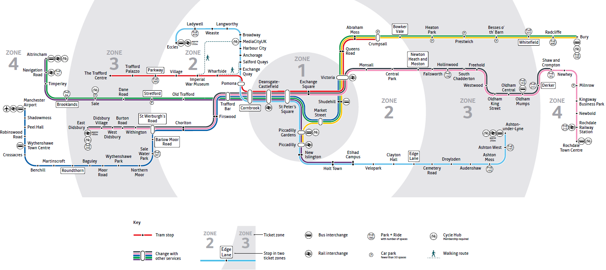
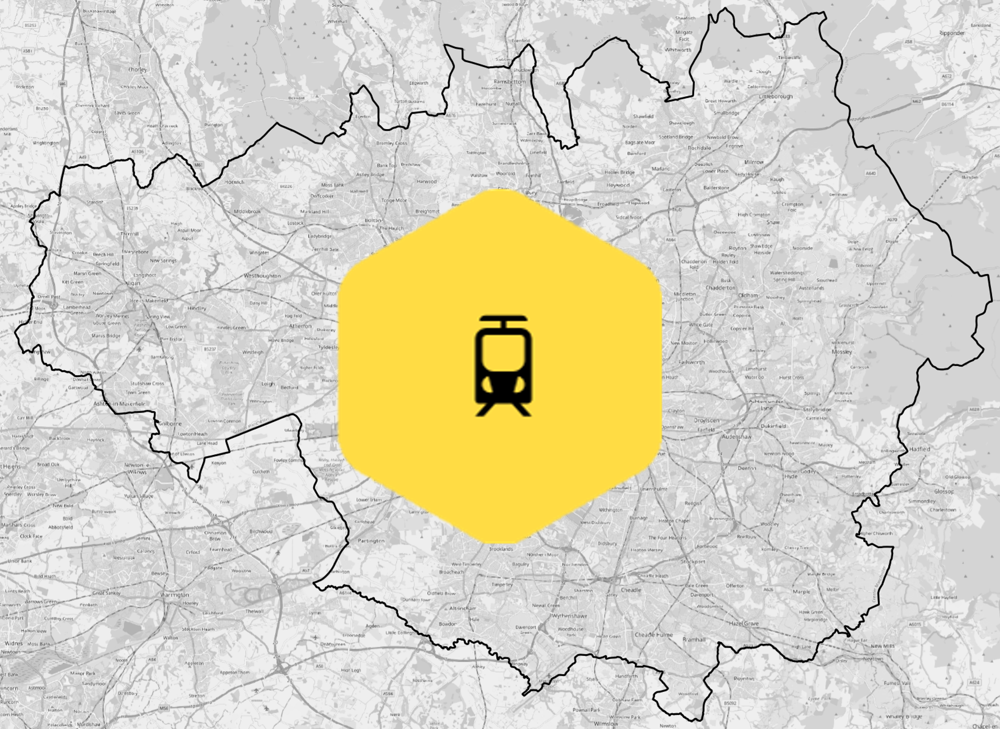

```{r setup, include=FALSE}
library(sf)
library(dplyr)
library(ggplot2)
library(tidyr)
library(kableExtra)
library(reticulate)
knitr::opts_chunk$set(echo = TRUE, warning = FALSE, message = FALSE)
```

class: center, middle, title-slide

# Spatial Join
## Claudia Gutiérrez-Arellano
### 30 April 2026 | The University of Manchester 
---
# Which areas in Greater Manchester are better served by the tram network?

<div style="text-align: center;">



<p class="image-caption">
Source: TfGM Metrolink Network Map

</p>

</div>


---

# Spatial join

- Combines attributes from one spatial dataset with another  

- **Key feature:**  Based on **location**, not a shared data (e.g. ID, name)


---

# Spatial join

- Combines attributes from one spatial dataset with another  

- **Key feature:**  Based on **location**, not a shared data (e.g. ID, name)

.pull-left[
- For example:  

  Which boroughs are not served by the tram network?
  
  Which borough has the most tram stops?
  
  Which tram stops are located within each borough?
]

.pull-right[
<div style="text-align: center;">

<p class="image-caption">
Source: Open Street Map, ONS Combined Authorities, TfGM
</div>
]


---
# Spatial join process

## Inputs - target feature  & source feature  
- Tram stops as **points**
- Boroughs as **polygons**

## Spatial rule
- For each tram stop, identify the borough it falls **within**

## Output
- Tram stops as **points**  
  Each tram stop inherits the attributes of the polygon
  
---

Tram stops (points) and boroughs (polygons)

```{r , echo=FALSE, message=FALSE, warning=FALSE,fig.width=12, fig.height=7, out.width="80%", fig.align="center", dpi=900}

boroughs = st_read("geodata/GM_lad.gpkg", quiet = TRUE) 
stops = st_read("geodata/Metrolink_Stops_Functional.json", quiet = TRUE) 

boroughs = st_transform(boroughs, 27700) 
stops = st_transform(stops, 27700)

borough_labels = st_point_on_surface(boroughs)

stops_in_borough = st_join(
  stops,          
  boroughs,       
  join = st_within 
)

inputs = ggplot() + 
  geom_sf(data = boroughs, fill = "#111827", colour = "white", linewidth = 0.2) +
  geom_sf(data = stops, colour = "#FFFF00", size = 3) + 
  geom_sf_text( data = borough_labels, aes(label = LAD22NM), size = 2, colour = "white" ) + 
  theme_void() 

inputs

```
<p class="image-caption">
GM Metrolink Network, Source: data.gov.uk; Local Authority Districts (Dec 2022), Source: ONS Geography
</p>
---
# Spatial join  in R

.pull-left[
Libraries 
```{r}
library(sf)         # simple features
library(tidyverse)  # data management
```
Function: `st_join`

Our Inputs
- target: `stops`
- source: `boroughs`

Our Rule: `st_within` (but there are many more!)

Our Output: `stops_in_borough`]

.pull-right[
Let's run!
```{r spatial-join, eval= FALSE, echo=TRUE, message=FALSE, warning=FALSE}

stops = st_read("geodata/Metrolink_Stops_Functional.json", quiet = TRUE)
boroughs = st_read("geodata/GM_lad.gpkg", quiet = TRUE) 

# check they have the same reference
st_crs(boroughs) == st_crs(stops) 
#[1] TRUE

stops_in_borough = st_join(
  stops,          
  boroughs,       
  join = st_within 
)
```
]

---

# Checking the output

.pull-left[
### Before: 
`stops`
```{r, echo=FALSE}
stops %>%
  st_drop_geometry()%>%
  select(name, stationCode) %>%
  head(4)

```

]

.pull-right[

### After: 
`stops_in_borough`
```{r, echo=FALSE}
stops_in_borough %>%
  st_drop_geometry() %>%
  select(name, stationCode, LAD22NM) %>%
  head(4)
```
]

*Use `glimpse(output_name)` for a quick check

---

## Answering some questions with our joined data

.pull-left[
### How many stops are there in each borough (LADs)?
### Which borough has the most tram stops?
```{r q1, echo=TRUE, message=FALSE, warning=FALSE}
borough_counts = stops_in_borough %>%
  st_drop_geometry() %>%
  count(LAD22NM, name = "n_stops")%>%
  arrange(-n_stops)
```

.pull-left[
```{r, echo=FALSE}

borough_counts %>%
  slice(1:ceiling(n()/2)) %>%
  select(LAD22NM, n_stops) %>%
  knitr::kable() %>%
  kable_styling(font_size = 12)
```
]

.pull-right[

```{r, echo=FALSE}
borough_counts %>%
  slice((ceiling(n()/2)+1):n()) %>%
  select(LAD22NM, n_stops) %>%
  knitr::kable() %>%
  kable_styling(font_size = 12)
```
]
]

.pull-right[

###Which boroughs are not served?

```{r q3, echo=TRUE, message=FALSE, warning=FALSE}
not_served = boroughs %>%
  st_drop_geometry() %>%
  anti_join(stops_in_borough, by = "LAD22NM") %>%
  select(LAD22NM)
```
<div class="three-col"> <div> 
```{r, echo=FALSE} 
not_served %>% 
  slice(1:ceiling(n()/3)) %>% 
  knitr::kable() %>% 
  kable_styling(font_size = 12) 
``` 
</div> <div> 

```{r, echo=FALSE} 
not_served %>% 
  slice((ceiling(n()/3)+1):ceiling(2*n()/3)) %>% knitr::kable() %>% kable_styling(font_size = 12) 
``` 
</div> <div> 
```{r, echo=FALSE} 
not_served %>% 
  slice((ceiling(2*n()/3)+1):n()) %>% knitr::kable() %>% kable_styling(font_size = 12) 
```
</div> </div> 
`anti_join` returns all rows from `boroughs` without a match

]


---

class: code-small

.pull-left[
## Spatial join in Python 
- Same inputs
- Same spatial rule: within
- Same type of output

<br>


]

.pull-right[
```{python, eval=FALSE}
import geopandas as gpd

stops_in_borough = gpd.sjoin(
    stops,
    boroughs,
    how="inner",
    predicate="within"
)

borough_counts = (
    stops_in_borough
    .groupby("LAD22NM")
    .size()
    .reset_index(name="n_stops")
)

not_served = (
    boroughs[["LAD22NM"]]
    .merge(stops_in_borough[["LAD22NM"]], on="LAD22NM", how="left", indicator=True)
    .query('_merge == "left_only"')
    [["LAD22NM"]]
)
```
]


---

class: code-small

.pull-left[
## Spatial join in Python 
- Same inputs
- Same spatial rule: within
- Same type of output

<br>


]

.pull-right[
```{python, eval=FALSE}
import geopandas as gpd

stops_in_borough = gpd.sjoin(
    stops,
    boroughs,
    how="inner",
    predicate="within"
)

borough_counts = (
    stops_in_borough
    .groupby("LAD22NM")
    .size()
    .reset_index(name="n_stops")
)

not_served = (
    boroughs[["LAD22NM"]]
    .merge(stops_in_borough[["LAD22NM"]], on="LAD22NM", how="left", indicator=True)
    .query('_merge == "left_only"')
    [["LAD22NM"]]
)
```
]


---

## Other spatial operations

| Spatial relationship | R (sf) | Python (GeoPandas) | Example |
|---------------------|--------|--------------------|---------|
| point within polygon | `join = st_within` | `predicate="within"` | Which schools are located within flood risk zones? |
| features overlap | `join = st_intersects` | `predicate="intersects"` | Which parks overlap flood zones? |
| boundaries touch | `join = st_touches` | `predicate="touches"` | Which protected areas border urban areas? |
| nearest feature* | `st_nearest_feature` | `sjoin_nearest()` | Which hospital is closest to each area? |

<div class="footer">
Explore: 
<a href="https://r-spatial.github.io/sf/reference/st_join.html" target="_blank">sf st_join</a> |
<a href="https://geopandas.org/en/stable/docs/reference/api/geopandas.GeoDataFrame.sjoin.html" target="_blank">geopandas sjoin</a>
</div>

---

class: middle

## Summary

- A spatial join links datasets using **location**, not IDs  

- It follows a **process**: inputs > spatial rule > output  
   
- We used a spatial join to identify the boroughs that are/are not served by the tram network 

- The same process applies in **R** and **Python**

---
class: middle
## A question for you

If a borough contains a tram stop, does that mean people across the whole borough have good access to the network?


---
class: middle
## Not necessarily

- Presence of stops $\neq$ accessibility

- Other analyses (wait to hear about `st_distance` and `st_buffer`!)


---
class: middle, center

# Questions?

<div class="footer">
Access the slides, data and code 
<a href="https://r-spatial.github.io/sf/reference/st_join.html" target="_blank">here</a> 
</div>


